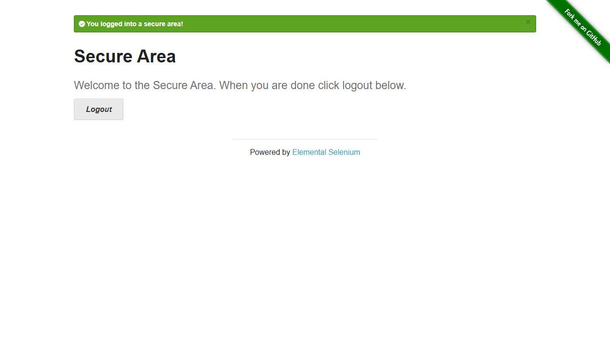
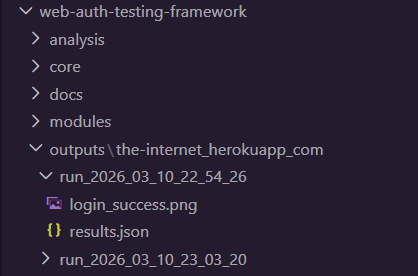

# Web Authentication Testing Framework


A modular Python framework designed for **automated authentication testing and session artifact analysis**.

This tool automates login flows using Playwright and extracts authentication-related data such as cookies, browser storage tokens, and headers for basic security analysis.

---

## Features

- Automated login using Playwright
- Manual login fallback for MFA / CAPTCHA / SSO flows
- Cookie security analysis
- JWT token detection in browser storage
- Authorization header detection
- Screenshot capture of login results
- Structured output for each test run
- Modular architecture for easy extension

---

## Project Structure

```
web-auth-testing-framework
│
├── core
│   ├── login_engine.py
│   ├── auth_collector.py
│   └── output_manager.py
│
├── modules
│   ├── playwright_login.py
│   └── manual_login.py
│
├── analysis
│   ├── cookie_analysis.py
│   ├── header_analysis.py
│   └── jwt_detector.py
│
├── outputs
│
├── main.py
├── requirements.txt
└── README.md
```

---

## Installation

Clone the repository:

```bash
git clone https://github.com/Suraj-Tirumali/web-auth-testing-framework.git
cd web-auth-testing-framework
```

Install Python dependencies:

```bash
pip install -r requirements.txt
```

Install Playwright browser binaries:

```bash
playwright install
```

---

## Quick Start

Run the framework against a demo login page:

```bash
python main.py --url https://the-internet.herokuapp.com/login --username tomsmith --password SuperSecretPassword!
```

This demo site is designed for authentication testing and will allow you to see the framework perform an automated login and generate analysis output.

---

## Usage

### Automated Login

Run automated login using credentials:

```bash
python main.py --url https://example.com/login --username user --password pass
```

The framework will:

1. Launch a Playwright browser
2. Attempt automated login
3. Capture authentication artifacts
4. Perform security analysis
5. Save results

---


### Manual Login (MFA / CAPTCHA / SSO)

Run without credentials:

```bash
python main.py --url https://example.com/login
```

This will:

1. Open a browser window
2. Allow manual login
3. Continue analysis after confirmation

---

## Example Run

### Automated Login



### Output Artifacts



---

## Output Example

Each execution generates a timestamped output directory.

Example structure:

```
outputs/
   example_com/
      run_2026_03_11_15_40_10/
         login_success.png
         results.json
```

---

## Example Result (`results.json`)

```json
{
  "url": "https://example.com/login",
  "login_status": "success",
  "method": "playwright",
  "cookies": [],
  "jwt_tokens": [],
  "auth_headers": [],
  "analysis": {
    "cookie_analysis": {},
    "header_analysis": {}
  }
}
```

---

## Security Checks Performed

The framework performs basic authentication security analysis:

| Check | Description |
|------|-------------|
| Cookie Flags | Detect cookies missing `HttpOnly` or `Secure` |
| JWT Detection | Identify JWT tokens in browser storage |
| Authorization Headers | Detect bearer tokens in headers |

---

## Use Cases

This framework can be used for:

- QA automation testing
- Authentication flow validation
- Session security analysis
- API authentication verification
- Security-focused test automation

---

## Future Improvements

Possible future enhancements include:

- Network request interception
- Automatic login form detection
- API authentication testing
- Extended security vulnerability checks

---

## Author

**Suraj Tirumali**

QA / Security Testing enthusiast focused on authentication testing and automation.